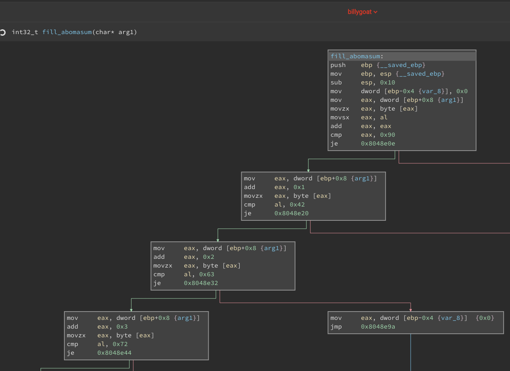

# battelle

Tried my hand at https://www.battelle.org/cyber-challenge/goat

Noticed it's a 32 bit executable so installed the appropriate packages

Loaded it onto binary ninja cloud free https://cloud.binary.ninja/

Ran the bugger and saw that it deletes itself :)

Looking at strings and strace it became clear it's looking for a file called 'chow.down'
```
strings billygoat
...
*HACK HACK HA-HHRGGGGGUUGGGHHHH*
Billygoat looks around... Angr fills his eyes.
Billygoat eats your offering...
The Ancient Goat Master appears before you and blesses you with a hint.
(unless you're viewing strings, then this is a lie.)
Billygoat doesn't seem to like what you fed him! *RUGRUUAARRGGGG*
chow.down
You ring the chow bell...
OH NO, here comes Billygoat!!
Billygoat looks pleased. He bows to you. Congratulations, you are now the goat master!
flag{%c%c%c%c_%c%c%c%c_%c%c%c%c_%c%c%c%c}
Your offering does not sit well with Billygoat!
;*2$"(
GCC: (Ubuntu 5.4.0-6ubuntu1~16.04.4) 5.4.0 20160609
crtstuff.c
__JCR_LIST__
deregister_tm_clones
__do_global_dtors_aux
completed.7200
__do_global_dtors_aux_fini_array_entry
...

strace billygoat
...
write(1, "OH NO, here comes Billygoat!!\n", 30OH NO, here comes Billygoat!!
) = 30
rt_sigprocmask(SIG_BLOCK, [CHLD], [], 8) = 0
rt_sigaction(SIGCHLD, NULL, {sa_handler=SIG_DFL, sa_mask=[], sa_flags=0}, 8) = 0
rt_sigprocmask(SIG_SETMASK, [], NULL, 8) = 0
nanosleep({tv_sec=2, tv_nsec=0}, 0xffb1a8ac) = 0
write(1, "A vortex appears in the sky, col"..., 112A vortex appears in the sky, colors so magnificent, the force so powerful. *Billygoat appears ready for dinner*
) = 112
rt_sigprocmask(SIG_BLOCK, [CHLD], [], 8) = 0
rt_sigaction(SIGCHLD, NULL, {sa_handler=SIG_DFL, sa_mask=[], sa_flags=0}, 8) = 0
rt_sigprocmask(SIG_SETMASK, [], NULL, 8) = 0
nanosleep({tv_sec=2, tv_nsec=0}, 0xffb1a8ac) = 0
open("chow.down", O_RDONLY)             = -1 ENOENT (No such file or directory)
write(1, "Billygoat looks around... Angr f"..., 47Billygoat looks around... Angr fills his eyes.
) = 47
close(-1)                               = -1 EBADF (Bad file descriptor)
unlink("/tmp/billygoat")                = -1 EPERM (Operation not permitted)
...

```

Reading the 4 subroutines a pattern of byte compares emerges that is clearly looking for specific characters in the file.  Once I saw that I started crafting a file with those characters.  The last subroutine tries to pull a fast one by doubling the value of the character. 


The `0x90` should've clued me in but I blazed past it since I was crafting the input file in hex.  Clearly that didn't work so I went back and looked closer at the subroutine then noticed the `add eax, eax`

The completed file
```
xxd /vagrant/chow.down
0000000: 2c3b 2e75 5040 685f 7c70 6e57 4842 6372  ,;.uP@h_|pnWHBcr
0000010: 0a   
```

And the win
```
./billygoat
You ring the chow bell...
OH NO, here comes Billygoat!!
Suddenly there is a massive crack of thunder shaking your bones until they hurt.
Billygoat has arrived. *Has he been groomed recently?* You find yourself thinking as the Sun glistens off his beautiful mane.
Billygoat eats your offering...
Billygoat looks pleased. He bows to you. Congratulations, you are now the goat master!

flag{l1vn_th4t_goat_l1f3}
```

That was fun.
